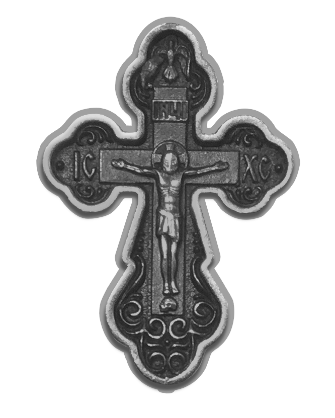

Во Имя Отца§ и Сы§на и Свята§го Ду§ха. Ами§нь.
 
**Моли§твами святы§х оте§ц на§ших, Го§споди Иису§се Христе§ Сы§не Бо§жий, поми§луй нас. Ами§нь.**
 
Го§споди, Иису§се Христе§ Сы§не Единоро§дный безнача§льного Твоего§ Отца§, Ты бо§ ре§кл еси§ пречи§стыми усты§ Твои§ми: я§ко бе§з Мене§ не мо§жете твори§ти ничесо§же. Го§споди, мо§й Го§споди, ве§рою объе§м в души§ мое§й и в се§рдце Тобо§ю рече§нная, припа§даю Твое§й бла§гоcти и молю§ся Ти: помози§ ми гре§шному де§ло мно§ю начина§емое о Тебе§ Само§м соверши§те, моли§твами Богоро§дицы и всех Твои§х святы§х. Ами§нь.
 

	При использовании другого шрифта потребуется удалить символ `§`

